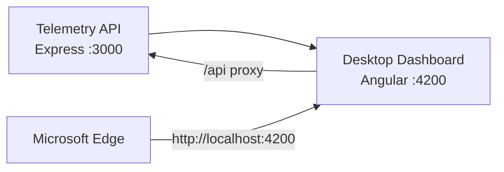

# Azure Debug Plan

> This plan is the source of truth for generating the
> VS Code debug setup in this workspace.
>
> **Status:** Implemented
> **Execution Mode:** Guided
> **Created:** 2026-10-07T20:37:16.3003784+05:30
> **Last Updated:** 2026-10-07T21:11:40.0000000+05:30
>
> <!-- Guided Mode (default) - hand-holds the user through review and approval before generating. -->
> <!-- Auto Mode (aka YOLO mode) — skips approval gates and runs generation unattended. -->

---

## Prerequisites

| Tool / Extension | Category | Service(s) | Installed | Version |
|------------------|----------|------------|-----------|---------|
| Node.js | Runtime | compressor-api, desktop | ✅ | 24.15.0 |
| npm | Package manager | compressor-api, desktop | ✅ | 11.12.1 |
| Angular CLI | Build tool | desktop | ✅ | 19.2.27 |
| Microsoft Edge | Browser | desktop | ✅ | 154.0.4258.62 |

> ⚠️ **Action required:** Angular CLI 19.2.27 reports Node.js 24.15.0 as unsupported. Use an Angular 19-supported Node.js version (20.11.1+ or 22.x) before starting frontend debugging.

---

## Debug Configurations

Each checked service produces a VS Code debug configuration in the workspace-level `.vscode/launch.json`. The existing Angular launch and tasks under `apps/desktop/.vscode/` will be preserved.

| Generate | Debug Config Name | Service Label | Service Root | Project Type | Runtime | Version | Azure Dependencies |
|----------|--------------------|---------------|--------------|--------------|---------|---------|---------------------|
| [x] | Telemetry API (debug) | Telemetry API | ./backend | app-service | node-ts | 24.15.0 | — |
| [x] | Desktop Dashboard (debug) | Desktop Dashboard | ./apps/desktop | frontend-spa | node-ts | 24.15.0 | — |
| [x] | Debug All Services | Debug All Services | — | *Compound Config* | — | — | — |

Project Type Descriptions

| Project Type | Description |
|-------------|-------------|
| app-service | HTTP server application using Express. |
| frontend-spa | Angular single-page application served by a development server. |
| *Compound Config* | Starts the local API before the dependent frontend. |

> **Proxy detected:** Desktop Dashboard proxies `/api` to Telemetry API at `http://localhost:3000`. The compound configuration should start the API before the frontend.

---

## Orchestrator

| Orchestrator | Container Runtime | Compose Command | Description |
|-------------|-------------------|-----------------|-------------|
| Docker Compose | Docker | `docker compose` | No containers or Azure emulators are needed by the detected services. Docker CLI and Compose are installed, but the Docker engine was not running during the scan. |

---

## Emulators

| Dependent Service | Emulator | Purpose |
|-------------------|----------|---------|
| — | None | No Azure SDK dependencies or Azure-hosted services were detected; this app uses in-memory telemetry. |

---

## Architecture Diagram

The Angular development server is opened in Edge and proxies API requests to the Express service; both run locally without Azure dependencies or emulator containers.

---

## API Test Collections

| Generate | Service | Description |
|----------|---------|-------------|
| [x] | Telemetry API | 

HTTP Endpoints (2)
 GET /api/health GET /api/dashboard 
 |

---

## Convenience Scripts

No additional scripts are planned; the API `dev` script and Angular `start` script already exist in their respective package manifests.

| Generate | Script | Registered In | Description |
|----------|--------|---------------|-------------|

## Debug Configuration Checklist

- ✅ Telemetry API (debug) — ready signal `Telemetry API listening on http://localhost:3000` observed and `Invoke-WebRequest http://localhost:3000/api/health` returned `200`.
- ✅ Desktop Dashboard (debug) — ready signal `Compiled successfully` observed on Angular dev server and `Invoke-WebRequest http://localhost:4200` returned `200`.
- ✅ Debug All Services — compound startup graph was verified as backend first then frontend, both services reached ready state, and the API dashboard endpoint returned a valid payload (`status=Warning`, `metricCount=4`).